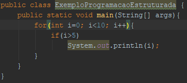
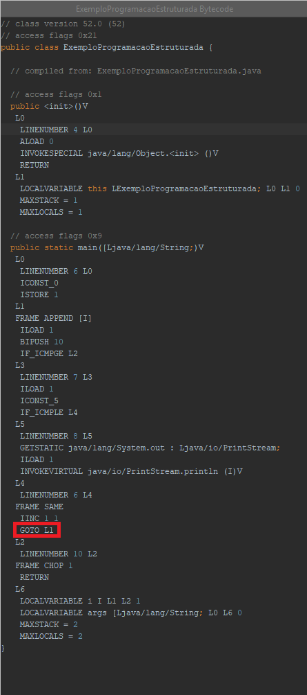
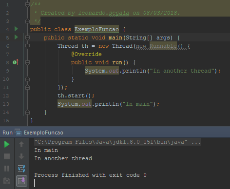
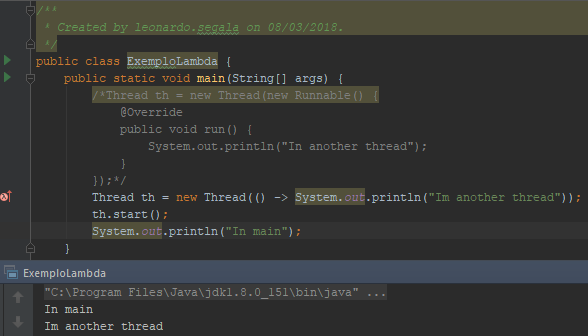
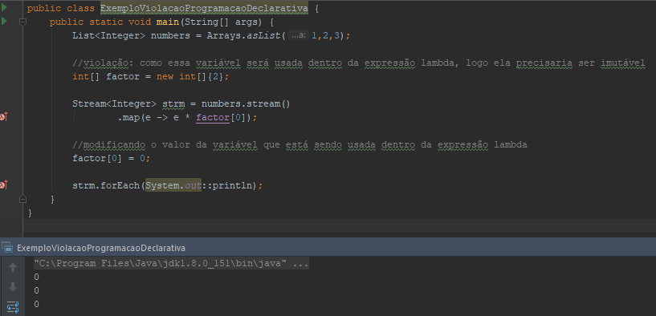

# Palestra Venkat Subramaniam Devoxx 2017
Link: https://www.youtube.com/watch?v=15X0qFtBqiQ
Link código original: http://agiledeveloper.com/presentations/functional_programming_in_java_8.zip

*  goto é programação estruturada

* atribuição é programação funcional

* Podemos passar objetos para funções
* Podemos criar objetos com funções
* Podemos retornar objetos de funções

* Funções de ordem superior
* Podemos passar funções para funções
* Podemos criar funções através de funções
* Podemos retornar funções de funções 

* Funções precisam ser puras
    * Funções puras não podem ter efeitos colaterais
        1. não podem mudar nada
        2. não dependem de nada que pode mudar

* Método é uma função que pertence à uma classes ou à um objeto
    * Uma função possui 4 características:
        1. nome
        2. tipo de retorno
        3. lista de parâmetros
        4. corpo

* Lambda expression
    * Características: 
        1. anônima
        2. tipo de retorno inferido
        3. lista de parâmetros
        4. corpo

Imperativo | Declarativo
---------- | -----------
como | o quê
mutável | tranforma
efeito coláteral | puro
passa objetos | passa funções também
difícil de compor | composição funcional

* Exemplo de violação de programação declarativa (imutabilidade)

* Exemplo de programação funcional usando paralelismo
[Exemplo](./src/ExemploParalelismo.java)